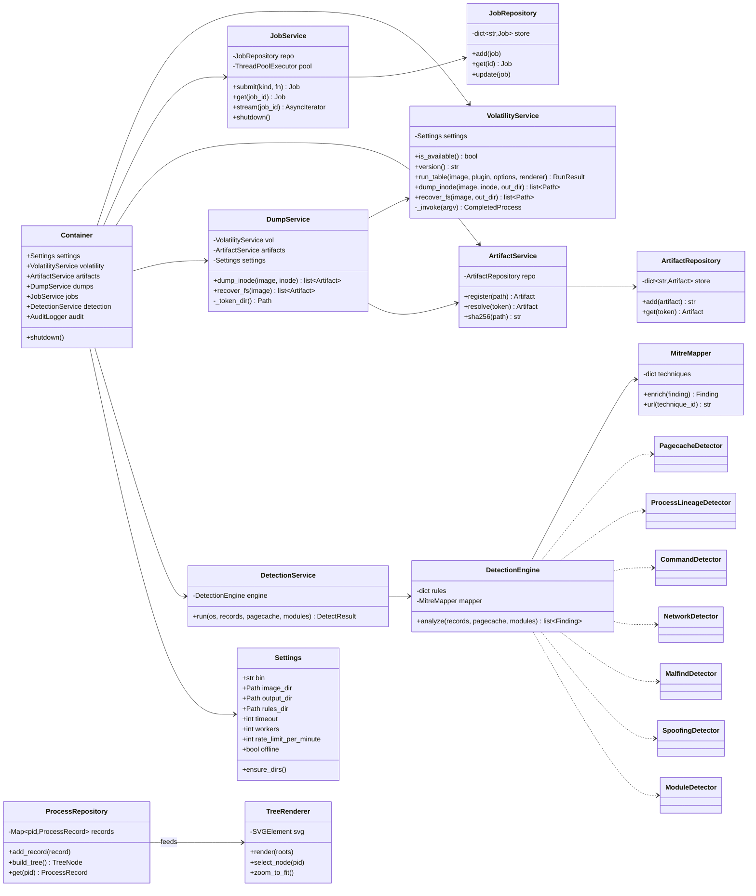

# DumpHound — Class Diagram

Core backend services, repositories, and the detection engine. The frontend
`TreeRenderer` (D3) is included to show the full analytical pipeline.

```mermaid
classDiagram
    direction LR

    class Settings {
        +str bin
        +Path image_dir
        +Path output_dir
        +Path rules_dir
        +int timeout
        +int workers
        +int rate_limit_per_minute
        +bool offline
        +ensure_dirs()
    }

    class Container {
        +Settings settings
        +VolatilityService volatility
        +ArtifactService artifacts
        +DumpService dumps
        +JobService jobs
        +DetectionService detection
        +AuditLogger audit
        +shutdown()
    }

    class VolatilityService {
        -Settings settings
        +is_available() bool
        +version() str
        +run_table(image, plugin, options, renderer) RunResult
        +dump_inode(image, inode, out_dir) list~Path~
        +recover_fs(image, out_dir) list~Path~
        -_invoke(argv) CompletedProcess
    }

    class JobService {
        -JobRepository repo
        -ThreadPoolExecutor pool
        +submit(kind, fn) Job
        +get(job_id) Job
        +stream(job_id) AsyncIterator
        +shutdown()
    }

    class ArtifactService {
        -ArtifactRepository repo
        +register(path) Artifact
        +resolve(token) Artifact
        +sha256(path) str
    }

    class DumpService {
        -VolatilityService vol
        -ArtifactService artifacts
        -Settings settings
        +dump_inode(image, inode) list~Artifact~
        +recover_fs(image) list~Artifact~
        -_token_dir() Path
    }

    class DetectionEngine {
        -dict rules
        -MitreMapper mapper
        +analyze(records, pagecache, modules) list~Finding~
    }

    class PagecacheDetector
    class ProcessLineageDetector
    class CommandDetector
    class NetworkDetector
    class MalfindDetector
    class SpoofingDetector
    class ModuleDetector
    class MitreMapper {
        -dict techniques
        +enrich(finding) Finding
        +url(technique_id) str
    }

    class DetectionService {
        -DetectionEngine engine
        +run(os, records, pagecache, modules) DetectResult
    }

    class JobRepository {
        -dict~str,Job~ store
        +add(job)
        +get(id) Job
        +update(job)
    }

    class ArtifactRepository {
        -dict~str,Artifact~ store
        +add(artifact) str
        +get(token) Artifact
    }

    class ProcessRepository {
        -Map~pid,ProcessRecord~ records
        +add_record(record)
        +build_tree() TreeNode
        +get(pid) ProcessRecord
    }

    class TreeRenderer {
        -SVGElement svg
        +render(roots)
        +select_node(pid)
        +zoom_to_fit()
    }

    Container --> VolatilityService
    Container --> JobService
    Container --> ArtifactService
    Container --> DumpService
    Container --> DetectionService
    Container --> Settings

    JobService --> JobRepository
    ArtifactService --> ArtifactRepository
    DumpService --> VolatilityService
    DumpService --> ArtifactService

    DetectionService --> DetectionEngine
    DetectionEngine --> MitreMapper
    DetectionEngine ..> PagecacheDetector
    DetectionEngine ..> ProcessLineageDetector
    DetectionEngine ..> CommandDetector
    DetectionEngine ..> NetworkDetector
    DetectionEngine ..> MalfindDetector
    DetectionEngine ..> SpoofingDetector
    DetectionEngine ..> ModuleDetector

    ProcessRepository --> TreeRenderer : feeds
```
