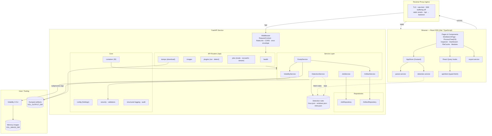

# DumpHound — Component Diagram

Full architecture: React SPA, FastAPI service tiers, and the data-driven
detection rule store shared by both ends.

## Tier responsibilities

| Tier | Responsibility |
|---|---|
| React SPA | Ingest CSVs, correlate, render tree, run client-side detection, export |
| nginx | TLS termination, static serving, rate limiting, disables SSE buffering |
| API routers | Thin HTTP adapters; validation + delegation only |
| Services | All business logic; `VolatilityService` is the sole subprocess caller |
| Repositories | In-memory persistence for jobs and artifacts |
| Core | Config, security guards, DI container, structured + audit logging |
| Rules store | Data-driven ATT&CK detection rules shared by client and server |
