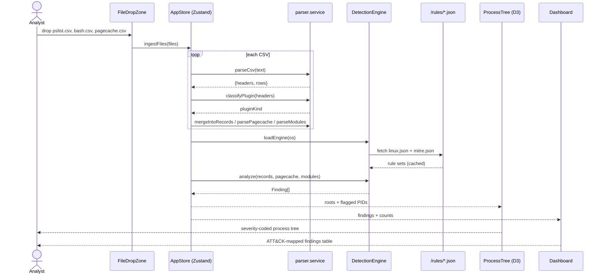
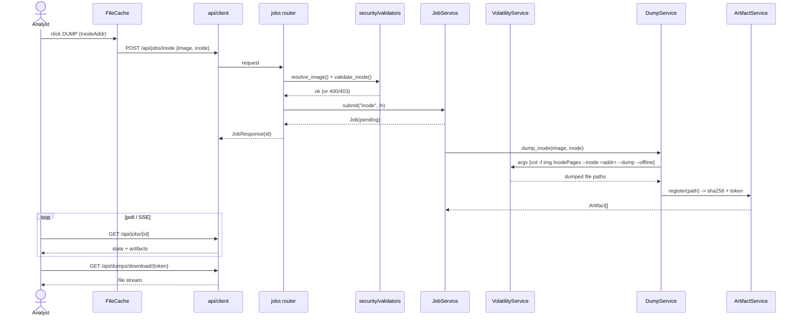

# ProcTree Platform — Sequence Diagrams

## 1. Offline CSV analysis (primary path)

The analyst drops Volatility CSV exports into the browser. Parsing, correlation,
and detection all run client-side — no image or raw data leaves the machine.

## 2. Live page-cache dump (backend path)

When connected to the backend, the analyst can extract a cached file straight
from the memory image. The job runs asynchronously and yields a secure,
token-addressed download.

